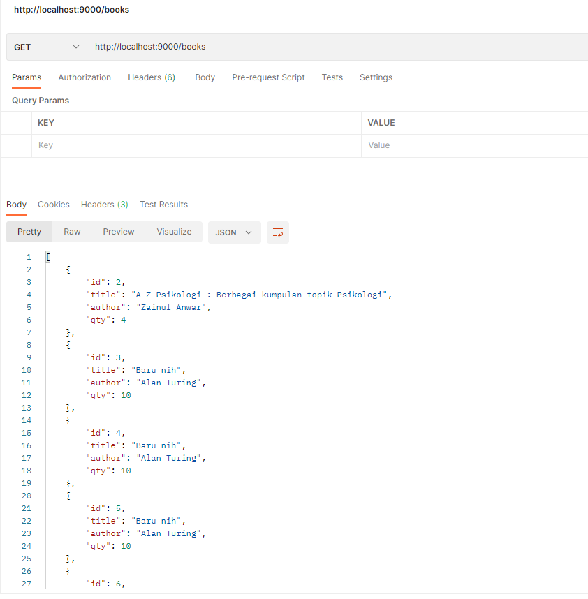
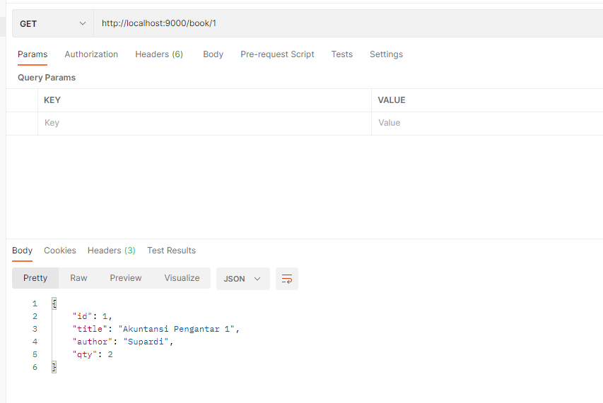
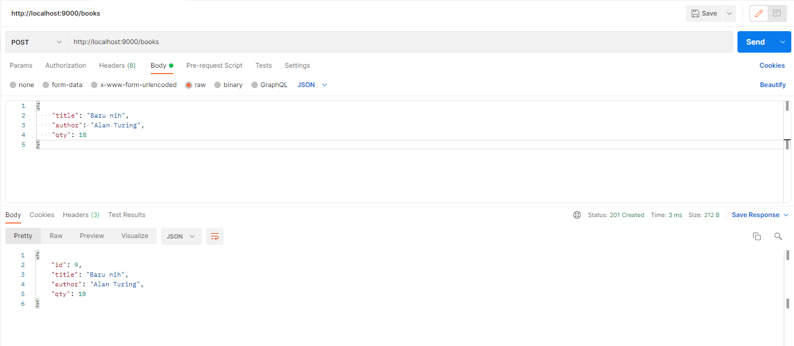
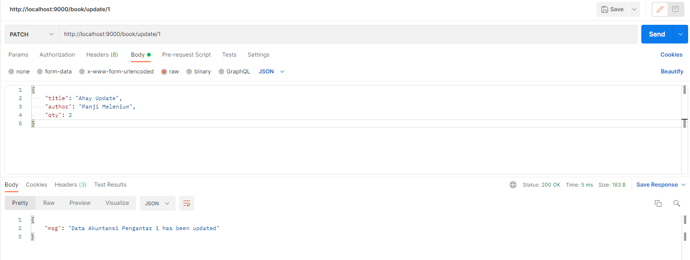
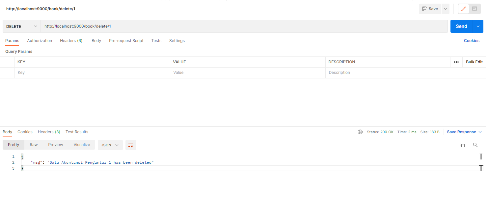

# GO API BASIC
---
Belajar membuat basic API dengan menggunakan GO-lang. Library/Package yang digunakan adalah Gin untuk Rest API.
List data berupa sebuah slice yang disimpan di dalam model.

Proyek sederhana ini hanya menggunakan konsep CRUD untuk data Buku.

### Cara pakai
1. Pastikan sudah ter-install GO-lang di komputer.
2. Clone reporsitory
3. Jalankan perintah `go get` di dalam direktori proyek untuk mendowload dependencies
4. Setelah selesai download dependencies kemudian jalankan proyek dengan perintah `go run main.go`
5. Buka Postman dan akses URI/Path dibawah ini

### URI/Path
1. Menampilkan seluruh data.
   - URL : `http://localhost:9000/books`
   - Method : `GET`
   

2. Menampilkan data berdasarkan ID.
   - URL : `http://localhost:9000/book/1`
   - Method : `GET`

3. Menambah data baru.
   - URL : `http://localhost:9000/books`
   - Method : `POST`
   

4. Mengubah data berdasarkan ID.
   - URL : `http://localhost:9000/book/update/1`
   - Method : `PATCH`

5. Menghapus data berdasarkan ID.
   - URL : `http://localhost:9000/book/delete/1`
   - Method : `DELETE`
     

